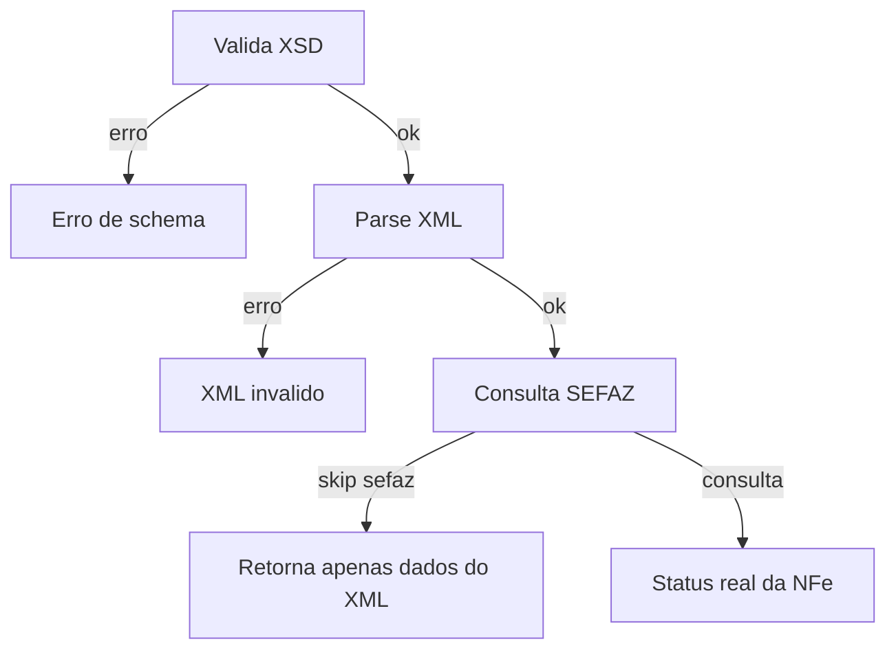
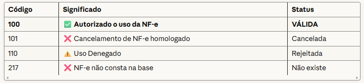

# Go NFE Validator 📄✅
<p>
   
      
  
  
</p>


Validador de **NF-e em Go**, focado em:

- ✅ **Validação XSD** usando *libxml2* via `go-xsd-validate`
- ✅ **Validação estrutural / de dados** (parse do XML)
- ✅ **Consulta real na SEFAZ** para verificar o status da chave
- ✅ Retorno em **JSON estruturado**, pronto para APIs, antifraude, auditoria etc.

Agora ele não é só “validador de schema”:  
é um **pipeline inteligente de validação + conferência na SEFAZ**.

---

## 🧠 O que o projeto faz hoje

Dado um arquivo XML de NF-e ou procNFe (`<NFe>` ou `<nfeProc>`), o validador:

1. **Valida o XML contra o XSD oficial da NF-e 4.00**
2. Se o XSD passou, faz **parse do XML** e extrai:
   - **Modelo** (`mod`)
   - **Série** (`serie`)
   - **Número** (`nNF`)
   - **Chave de acesso** (`chNFe`)
   - **CNPJ** e razão social do emitente
   - **CNPJ/CPF** e nome do destinatário
   - **Valor total da nota** (`vNF`)
3. Opcionalmente, consulta a **SEFAZ real** para:
   - verificar se a nota existe,
   - se está **autorizada**, **cancelada**, **denegada**, etc.
4. Retorna um **JSON** com o resultado consolidado.

---

## 🧪 Exemplo de saída (JSON)

```json
{
  "tipo": "nfe",
  "chave_acesso": "12349874111111000123550010000040421000040420",
  "valido_xsd": true,
  "sefaz": {
    "consultado": true,
    "autorizado": true,
    "codigo": "100",
    "mensagem": "Autorizado o uso da NF-e"
  },
  "dados_xml": {
    "modelo": "55",
    "serie": "1",
    "numero": "4042",
    "emitente_cnpj": "12345678000199",
    "emitente_razao": "EMPRESA EXEMPLO LTDA",
    "destinatario_doc": "98765432000188",
    "destinatario_nome": "CLIENTE TESTE",
    "valor_total_nota": "199.90"
  }
}
```

---

## 🚀 Uso rápido

Exemplo de execução:

```bash
./validador nota.xml schema.xsd
```

Comportamento padrão:

1. **Sempre** valida contra o XSD.
2. Se o XSD passar:
   - faz parse do XML;
   - consulta a SEFAZ, a menos que você use uma flag para pular essa etapa (ex.: `--skip-sefaz`).
3. Se você quiser **apenas XSD**, pode usar uma flag específica (ex.: `--xsd-only`) para encerrar o fluxo após a validação de schema.

> Os nomes exatos das flags estão documentados na ajuda do binário (`-h` / `--help`).

---

## 🧩 Fluxo Inteligente

Fluxo lógico atual do validador:




Em resumo:

- **XSD sempre roda primeiro**.
- Se o XSD falhar → erro e fim.
- Se o XSD passar:
  - faz parse do XML (para extrair dados de nota);
  - se não estiver em modo “só XSD” e não usar `--skip-sefaz`, consulta a SEFAZ e enriquece o resultado com o status real da NF-e.

---

## 📚 Schemas (XSD) via `sefaz-scraper`

Os schemas oficiais **não ficam hardcoded** aqui dentro:  
este projeto usa os XSDs atualizados pelo seu outro projeto:

- 🔗 [`fabyo/sefaz-scraper`](https://github.com/fabyo/sefaz-scraper)

A ideia é:

- `sefaz-scraper` baixa/atualiza os XSDs direto das SEFAZ/Portal;
- `go-nfe-validator` aponta para essa pasta, garantindo validação sempre com os **layouts oficiais mais recentes**.

Documente no código/flags o caminho esperado para os XSD (ex.: `--schema-dir`), conforme sua estrutura local.

---

## 🎯 Objetivo do projeto

Ser um **núcleo técnico** sólido para:

- validação forte de NF-e (estrutura + XSD),
- conferência real na SEFAZ,
- saída estruturada em JSON,
- base para:
  - antifraude,
  - robôs de conferência fiscal,
  - integrações com outros sistemas (ERPs, BI, IA, etc.).

A partir daqui, é “só” ir plugando emissão, eventos, distribuição DF-e… 😉
